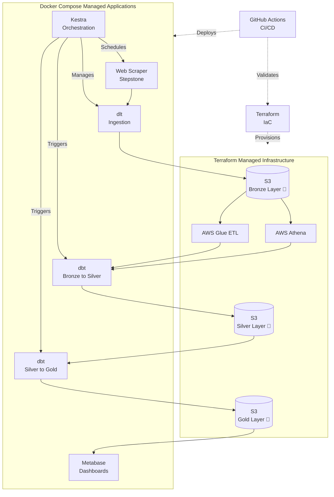

# Job Market Data Pipeline

## Project Overview

This project creates an end-to-end data pipeline for scraping, processing, and analyzing job postings from Stepstone. The goal is to build a comprehensive dataset of job listings with detailed attributes to enable insights about the job market, particularly focusing on data-related roles in Hamburg, Germany.

## Problem Statement

Finding relevant job opportunities in the data field requires searching through multiple job portals and analyzing numerous listings. This project aims to:

1. Automate the collection of job postings from Stepstone
2. Standardize and clean the collected data
3. Store the data in a structured database
4. Provide analytics on job trends, required skills, salary distributions, etc.
5. Create visualizations to better understand the job market

## Architecture

The pipeline consists of the following components:



1. **Data Collection**: Web scraper for Stepstone with robust error handling and retry mechanisms
2. **Data Storage**: AWS S3 for raw data (bronze layer), AWS Athena for querying, optimized storage formats
3. **Data Processing**:
   - dlt for ingestion with validation
   - dbt for bronze to silver transformation (cleaning and standardizing data)
   - dbt for silver to gold transformation (creating analytics-ready tables)
4. **Orchestration**: Kestra for workflow management, monitoring, and alerting
5. **Visualization**: Metabase for interactive dashboards and insights delivery

### AWS Service Selection: Athena vs. Redshift vs. Glue

For this project, we've made a cost-conscious decision regarding AWS services:

#### AWS Athena: Primary Analytics Engine

- **Cost-effective**: Pay only for the queries you run ($5 per TB scanned)
- **Serverless**: No infrastructure to manage
- **Simplicity**: Direct querying of data in S3 using standard SQL
- **Integration**: Works seamlessly with our S3 data lake approach

#### AWS Glue: Alternative to Redshift

- **Why Glue instead of Redshift?**
  - Redshift is unnecessary for our current data volume and workload
  - Redshift requires provisioned clusters (minimum ~$200/month even when idle)
- Our analytical needs can be met with Athena + occasional Glue ETL jobs

- **Glue Benefits**:
  - Serverless ETL service with pay-per-use pricing
  - Automatic schema discovery with Data Catalog
  - Only pay for ETL job runtime (typically cheaper for batch workloads)
  - Integrates well with both S3 and Athena
  
- **Cost Comparison**:
  - Redshift: $0.25-$4.80 per hour per node (24/7) + storage costs
  - Glue: ~$0.44 per DPU-hour (only when jobs are running)
  - For our batch pipeline, Glue could be 70-90% cheaper than Redshift

#### Simplest and Cheapest Solution

For our current requirements, the most cost-effective architecture is:

1. S3 for storage (bronze, silver, gold layers)
2. AWS Athena for SQL querying capabilities
3. AWS Glue for more complex ETL when needed
4. dbt for most transformations

This approach offers:

- Minimal fixed costs (only S3 storage)
- Pay-per-query model with Athena
- Flexibility to scale up or down based on actual usage
- No complex infrastructure to maintain

### Infrastructure Management

The project uses a dual infrastructure management approach:

#### Terraform-Managed Infrastructure

- **AWS Cloud Resources**: All cloud resources including S3 buckets, Athena workgroups, and AWS Glue ETL jobs
- **IAM Roles & Policies**: Security configurations for AWS services
- **Network Configuration**: VPC, Security Groups, and network access rules

#### Docker Compose-Managed Applications

- **Kestra**: Workflow orchestration engine running in containers
- **Metabase**: Dashboard and visualization platform running in containers
- **Local Development Services**: Any additional services needed for local development
- **Application Configuration**: Environment variables and service connections

This separation allows for:

1. **Cloud Infrastructure Consistency**: Terraform ensures cloud resources are provisioned consistently
2. **Application Portability**: Docker Compose makes application deployment consistent across environments
3. **Local Development**: Ability to run applications locally while connecting to cloud or mock resources
4. **Clear Separation of Concerns**: Distinct responsibilities for infrastructure vs. application management

### Component Management

- **AWS Resources** (S3, Athena, Glue): Provisioned through Terraform
- **Kestra**: Run as Docker containers managed by Docker Compose
- **dbt**: Executed either locally or through Kestra workflows
- **Metabase**: Deployed as a Docker container
- **CI/CD Pipeline**: GitHub Actions for testing and deployment automation

## Technologies Used

- **Cloud**: AWS (S3, Athena, Glue)
- **Infrastructure as Code**: Terraform for reproducible infrastructure provisioning
- **Workflow Orchestration**: Kestra for reliable pipeline scheduling and management
- **Data Ingestion**: Python scraper with dlt for structured batch processing
- **Data Warehouse**: AWS Athena with optimized partitioning and Parquet compression
- **ETL Processing**: AWS Glue for complex transformations
- **Transformations**: dbt for modular, testable SQL-based transformations
- **Dashboard**: Metabase with multiple visualization tiles and automated refresh

## Dataset

The dataset contains job listings with attributes including:

- Job title and description (with standardized categorization)
- Company information and industry
- Location details with geocoding for spatial analysis
- Salary information (when available) with standardized ranges
- Required skills and technologies (extracted and normalized)
- Experience level requirements
- Employment type (full-time, part-time, contract, etc.)
- Remote work options (fully remote, hybrid, on-site)
- Date posted and application deadlines
- Benefits and perks mentioned

## Reproducibility: Setup and Installation

### Prerequisites

- Python 3.11.8
- AWS account with appropriate permissions
- Docker and Docker Compose (for application services)
- Terraform (for cloud infrastructure)
- Make

### Step 1: Clone the Repository

```bash
git clone <repository-url>
cd job-market-data-pipeline
```

### Step 2: Set Up Environment

```bash
# Create and activate virtual environment
python -m venv .venv
source .venv/bin/activate  # On Windows: .venv\Scripts\activate

# Install dependencies
pip install -r requirements.txt
```

### Step 3: Configure AWS Infrastructure with Terraform

```bash
# Copy configuration examples and edit with your values
cp .env.example .env
cp infrastructure/terraform/terraform.tfvars.example infrastructure/terraform/terraform.tfvars
cp infrastructure/terraform/set_env.sh.example infrastructure/terraform/set_env.sh

# Edit terraform.tfvars with your settings
chmod +x infrastructure/terraform/set_env.sh
source infrastructure/terraform/set_env.sh

# Deploy cloud infrastructure
cd infrastructure/terraform
terraform init
terraform apply
```

### Step 4: Deploy Application Services with Docker Compose

```bash
# Start application services
docker-compose up -d

# Deploy Kestra workflows
kestra deployments create --from ./pipeline/kestra_workflows

# Start Metabase and configure data sources
docker-compose logs metabase # To get initial setup URL
```

### Step 5: Run Transformations

```bash
# Run dbt models
cd dbt
dbt run
```

### Step 6: Access the Dashboard

Open Metabase at <http://localhost:3000> and access the job market dashboard.

## Data Ingestion (Batch Processing)

This project uses batch processing with the following workflow:

1. **Web Scraping**: Python scraper runs daily to collect new job postings
2. **Data Validation**: Validation and cleaning of scraped data
3. **S3 Storage**: Raw data stored in S3 with date partitioning
4. **Orchestration**: Full pipeline managed by Kestra with error handling and retries

## Data Warehouse

The data warehouse is designed using AWS Athena with performance optimizations:

1. **Table Design**:
   - Job listings partitioned by posting_date for efficient time-series queries
   - Compressed Parquet format for faster queries and reduced costs
   - Optimized column ordering based on common query patterns

2. **Optimization Strategies**:
   - Partition pruning for efficient filtering
   - Column projection to minimize data scanned
   - Strategic data partitioning to reduce query costs
   - Views for common query patterns

## Transformations

Data transformations are managed with dbt:

1. **Bronze Layer** 🥉: Raw data from S3
2. **Silver Layer** 🥈: Cleaned and standardized data
   - Standardized job titles and categories
   - Extracted skills from descriptions
   - Normalized company information
3. **Gold Layer** 🥇: Analytics-ready tables
   - Aggregated metrics by company, location, and skill
   - Time-series data for trend analysis

## Dashboard

The Metabase dashboard provides insights with multiple visualization tiles:

1. **Job Postings by Category**: Pie chart showing distribution of jobs across categories
2. **Temporal Trends**: Line graph showing job posting volume over time
3. **Skills in Demand**: Bar chart of most requested skills
4. **Salary Distribution**: Box plot of salary ranges by job category
5. **Geographic Distribution**: Map visualization of job locations

## Terraform State Management

This project follows standard Terraform practices for state management:

1. **Local State (Development)**: Default for initial development
2. **Remote State (Team/Production)**: S3 backend for team collaboration

### Remote State Setup

```bash
# Create the state bucket (one-time setup)
aws s3api create-bucket \
  --bucket terraform-state-job-pipeline \
  --region eu-central-1 \
  --create-bucket-configuration LocationConstraint=eu-central-1

# Enable versioning for state protection
aws s3api put-bucket-versioning \
  --bucket terraform-state-job-pipeline \
  --versioning-configuration Status=Enabled
```

4. **Deployment**: Automatic deployment to development environment

## Infrastructure Setup

To set up the cloud infrastructure for this project, follow these steps:

1. **Configure AWS CLI:**
   Ensure you have the AWS CLI configured with your credentials and the necessary permissions.

   ```sh
   aws configure
   ```

2. **Set Environment Variables:**
   Copy the `set_env.sh.example` file to `set_env.sh` and update the values with your AWS credentials and key pair name.

   ```sh
   cp infrastructure/terraform/set_env.sh.example infrastructure/terraform/set_env.sh
   nano infrastructure/terraform/set_env.sh
   ```

   Source the environment variables:

   ```sh
   source infrastructure/terraform/set_env.sh
   ```

3. **Initialize Terraform:**
   Navigate to the Terraform directory and initialize Terraform.

   ```sh
   cd infrastructure/terraform
   terraform init
   ```

4. **Apply Terraform Configuration:**
   Apply the Terraform configuration to create the AWS resources.

   ```sh
   terraform apply -var-file="terraform.tfvars"
   ```

5. **Verify Resources:**
   Verify that the resources have been created successfully in the AWS Management Console.

This will set up the S3 buckets, Athena workgroup and databases, and the EC2 instance with Kestra setup.

## Docker Setup 🐳

This project is containerized using Docker to ensure consistent environments across development, testing, and production.

### Prerequisites

- Docker
- Docker Compose

### Running with Docker

1. **Build and start the containers:**

```bash
# Build and start all services in detached mode
make up

# Or using docker-compose directly
docker-compose up --build -d
```

2. **Run just the scraper:**

```bash
make scrape

# Or using docker-compose directly
docker-compose run job-scraper
```

3. **Access Metabase:**

Open your browser and navigate to `http://localhost:3000` to access the Metabase dashboard.

4. **Stop all containers:**

```bash
make down

# Or using docker-compose directly
docker-compose down
```

### Development with Docker

- **Running tests:**

```bash
make test
```

- **Code linting and formatting:**

```bash
make lint
make format
```

- **Interactive shell:**

```bash
docker-compose run --rm job-scraper bash
```

### Docker Architecture

The Docker setup consists of the following services:

1. **job-scraper**: The main application container that runs the job scraper and data processing
2. **metabase**: Visualization and analytics dashboard
3. **postgres**: Database for storing Metabase metadata and configuration

Additional services (commented out in docker-compose.yml):

- **kestra**: For workflow orchestration when needed

## Configuration Files

### DLT Pipeline Configuration 📊

This project uses DLT (Data Load Tool) for data ingestion. To configure DLT:

1. Create a `.dlt` directory in the project root (if it doesn't exist):
   ```bash
   mkdir -p .dlt
   ```

2. Copy the example secrets file and modify it for your environment:
   ```bash
   cp .dlt/secrets.toml.example .dlt/secrets.toml
   ```

3. Edit `.dlt/secrets.toml` with your configuration:
   ```toml
   [destination.filesystem]
   bucket_url = "file:///path/to/your/data/folder"
   ```

   For S3 configuration, uncomment and configure the S3 section:
   ```toml
   [destination.s3]
   bucket_name = "your-s3-bucket-name"
   region_name = "your-aws-region"
   ```

## Project Structure

```plaintext
.
├── data
│   ├── raw        # Bronze layer - raw data as collected
│   ├── processed  # Silver layer - cleaned and processed data
│   └── analytics  # Gold layer - analytics-ready data
├── src
│   ├── data_processing  # Code for data transformation
│   ├── data_collection  # Code for collecting data
│   └── analytics        # Code for analysis and insights
├── scripts             # Executable scripts
└── tests               # Unit tests
```

## Implementation Status

### 1. Data Collection (🟡 In Progress)

- [x] Created the scraper module structure
- [x] Implemented `StepstoneScraper` for extracting job listings
- [x] Built `JobParser` for structured data extraction
- [x] Added unit tests for scraper components
- [ ] Implement data saving functionality
- [ ] Add support for other job portals

### 2. Data Storage (🟢 Configured)

- [x] Created S3 buckets in Terraform
- [x] Configured folder structure for bronze data layer
- [x] Implemented dlt pipeline for structured ingestion
- [x] Added filesystem destination support for local development
- [x] Configured S3 destination for cloud deployment
- [ ] Set up data validation

### 3. Data Processing (🟡 In Progress)

- [x] Created job data enrichment functionality
- [x] Implemented data quality verification metrics
- [ ] Create dbt models for transformations
- [ ] Implement standardization logic
- [ ] Build analytics views

### 4. Orchestration (🔴 Not Started)

- [ ] Create Kestra workflows
- [ ] Set up scheduling and monitoring

### 5. Visualization (🔴 Not Started)

- [ ] Configure Metabase instance
- [ ] Create dashboards for job market insights

### Module Documentation

Each major component of the project has its own README for more detailed documentation:

- [Scraper Module](/src/scraper/README.md) - Web scraper implementation

## Security Best Practices

- All sensitive configuration files are excluded from version control
- IAM roles follow the principle of least privilege
- Network security with VPC and security groups
- Encryption for data at rest and in transit

## Future Enhancements

- Add more job portals (LinkedIn, Indeed, etc.)
- Implement NLP for better skill extraction
- Build a recommendation system
- Create a REST API for querying data

## License

[License information]

## Contributing

[Contribution guidelines]
