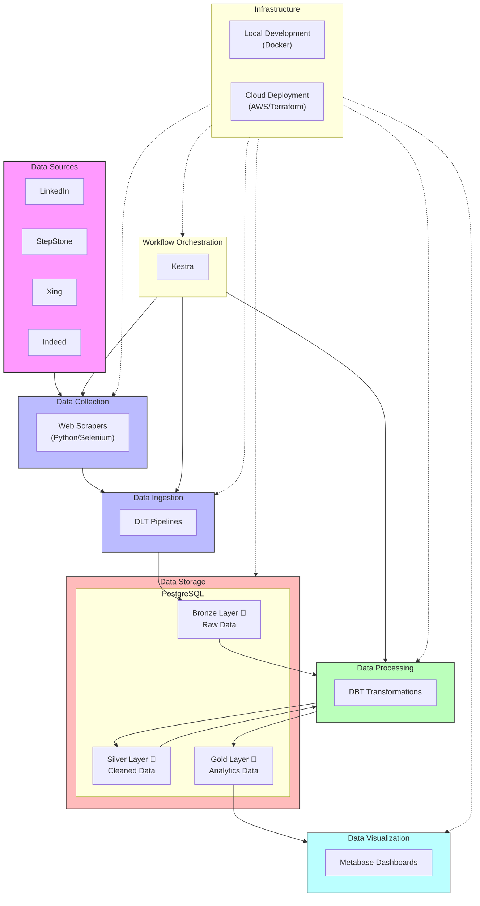

# Job Analytics Platform Architecture

## Overview

The Job Analytics Platform follows a modern data engineering architecture with clear separation of concerns:

1. **Data Collection Layer**: Web scrapers extract job listings from various platforms
2. **Data Processing Layer**: ETL pipeline for data transformation
3. **Storage Layer**: PostgreSQL database following medallion architecture
4. **Analytics Layer**: Metabase dashboards for visualization

## Medallion Architecture

### Bronze Layer 🥉

- Raw data exactly as collected from source
- No transformations or cleaning
- Complete historical record

### Silver Layer 🥈

- Cleaned and standardized data
- Duplicates removed
- Data types corrected
- Common schema applied across sources

### Gold Layer 🥇

- Analytics-ready datasets
- Aggregations and derived metrics
- Optimized for dashboard performance

## Component Diagram

## Cloud Architecture

For AWS deployment, the platform uses the following services:

- **Amazon S3**: For storing raw and processed data files
- **Amazon RDS (PostgreSQL)**: For the data warehouse following medallion architecture
- **Amazon ECS/Fargate**: For running containerized scrapers and pipeline components
- **AWS Lambda**: For lightweight processing tasks
- **Amazon CloudWatch**: For monitoring and logging
- **AWS IAM**: For security and access management

## Local Development Architecture

The local development environment uses Docker Compose to provide:

- PostgreSQL database container
- Metabase container for dashboards
- Kestra container for workflow orchestration
- Python containers for scrapers and pipelines

## Data Flow Details

1. **Job Listings Collection**:
   - Scheduled scrapers collect job listings from multiple sources
   - Raw data is stored in the Bronze layer with source metadata

2. **Data Cleaning & Standardization**:
   - DLT pipelines perform initial validation and loading
   - DBT models transform data into the Silver layer
   - Deduplication, normalization, and standardization are applied

3. **Analytics Preparation**:
   - DBT models create Gold layer tables optimized for analytics
   - Aggregations, metrics, and dimensional models are prepared

4. **Dashboard Visualization**:
   - Metabase connects to Gold layer tables
   - Interactive dashboards provide market insights
